Understood. Below is **one single, continuous, copy-and-paste Markdown block** with **no breaks, no commentary, no splitting**. You can paste this **directly into GitHub** (`README.md` or `/docs/architecture.md`) and it will render correctly with Mermaid enabled.

---

````md
# SkillSwap System Architecture & Database Specification

**BPA Web Application Team – Technical Documentation**  
**Reedy High School BPA Chapter | Frisco, Texas | 2026**

**Team:** Jyothir Manchu, Aaryan Porwal, Rishik Pamuru  
**Document Version:** 2.0  
**Last Updated:** January 14, 2026

---

## 1. System Overview

SkillSwap is a database-driven web application built on a Node.js/Express backend with SQLite 3 persistence. The system enables students to exchange skills through direct requests or public session offers while enforcing strong security, normalization, and auditability standards aligned with BPA Web Application Team requirements.

---

## 2. High-Level System Architecture

```mermaid
flowchart TB
    subgraph Client["Client Layer"]
        Browser["Web Browser"]
        SPA["Single Page Application<br/>(HTML / CSS / JS)"]
    end
    
    subgraph Server["Server Layer (Node.js / Express)"]
        Express["Express.js Server"]
        
        subgraph Middleware["Middleware Stack"]
            Helmet["Helmet.js<br/>(Security Headers)"]
            RateLimit["Rate Limiting<br/>(100 req / 15 min)"]
            Session["Session Manager<br/>(express-session)"]
            Auth["Authentication<br/>(bcrypt)"]
            Validation["Input Validation"]
            Audit["Audit Logger"]
        end
        
        subgraph Routes["API Routes"]
            AuthRoutes["/api/auth"]
            UserRoutes["/api/users"]
            SessionRoutes["/api/sessions"]
            OfferRoutes["/api/offers"]
            MessageRoutes["/api/messages"]
            RatingRoutes["/api/ratings"]
            AdminRoutes["/api/admin"]
            AIRoutes["/api/ai"]
        end
    end
    
    subgraph Database["Data Layer"]
        SQLite["SQLite Database<br/>(skillswap.db)"]
    end
    
    subgraph External["External Services"]
        GeminiAI["Google Gemini AI API<br/>(AI Tutor)"]
        FontAwesome["Font Awesome CDN"]
    end
    
    Browser --> SPA
    SPA --> Express
    Express --> Middleware
    Middleware --> Routes
    Routes --> SQLite
    AIRoutes --> GeminiAI
    SPA --> FontAwesome
````

---

## 3. Database Overview

```mermaid
classDiagram
    class DatabaseOverview {
        Database_Type : SQLite 3
        Driver : sqlite3 (async)
        Tooling : better-sqlite3
        Normalization : Third Normal Form (3NF)
        Total_Tables : 13
        Total_Indexes : 18
        Triggers : 5
        Views : 3
    }
```

---

## 4. Initialization & Runtime Migrations

SkillSwap uses a self-healing SQLite architecture.

* Canonical schema defined in `config/schema.sql`
* Database file (`skillswap.db`) is created automatically on first run
* Startup migrations in `config/database.js` perform PRAGMA checks and safe ALTER TABLE operations to maintain backward compatibility

---

## 5. Database Entity Relationship Diagram

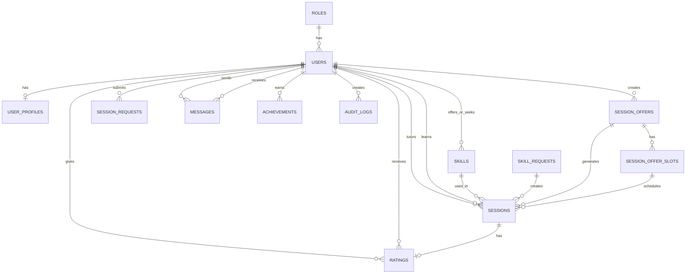

---

## 6. Core Database Tables

### Roles

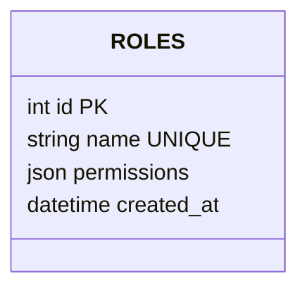

### Users

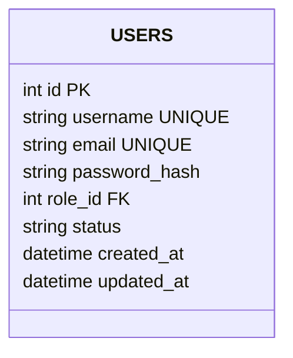

### User Profiles

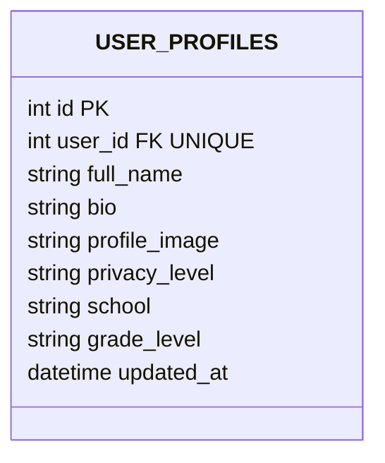

### Skills

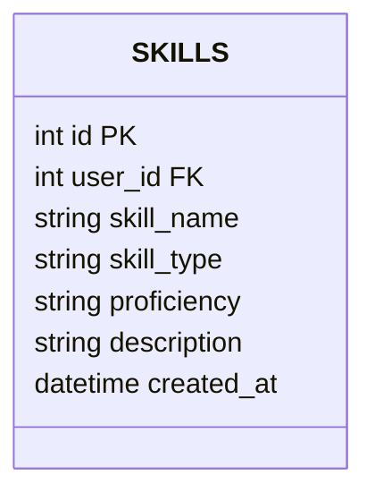

### Sessions

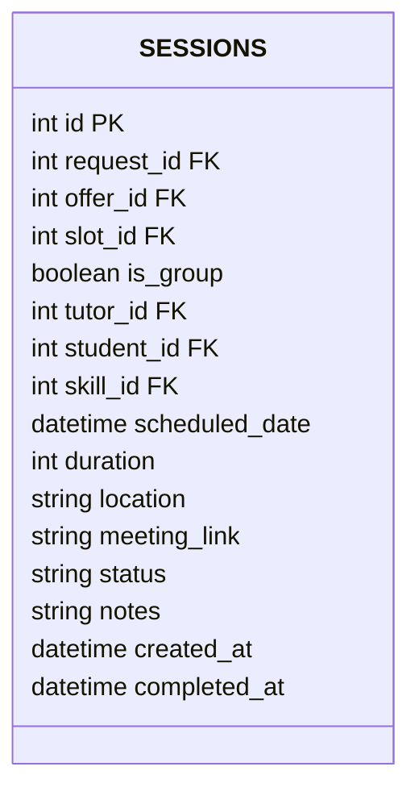

---

## 7. Request Lifecycle

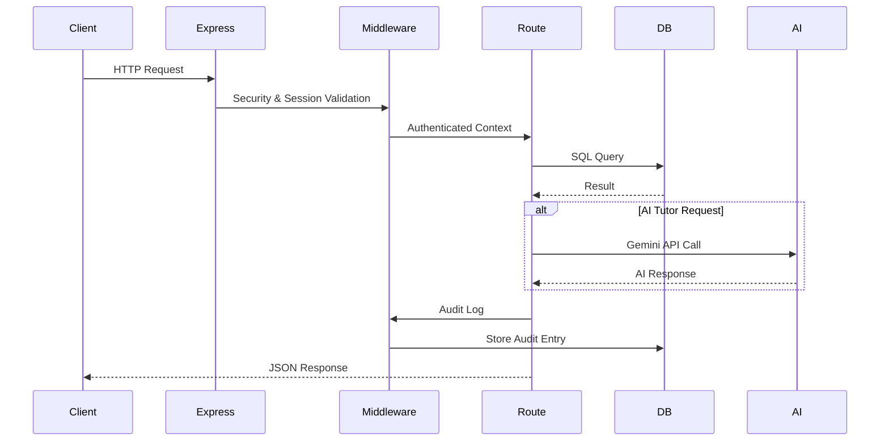

---

## 8. Security Architecture

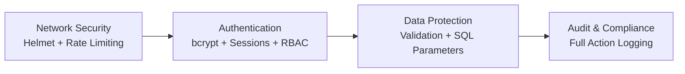

---

## 9. Security Controls

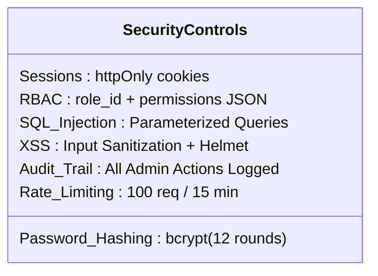

---

## 10. Normalization Compliance

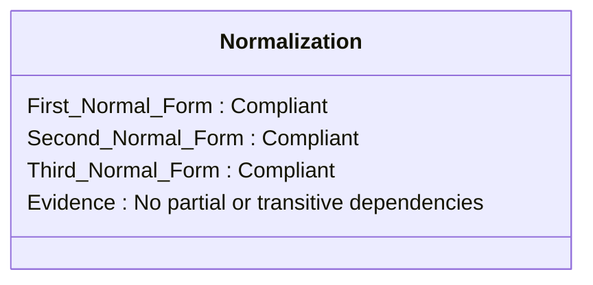

---

## 11. BPA Rubric Alignment

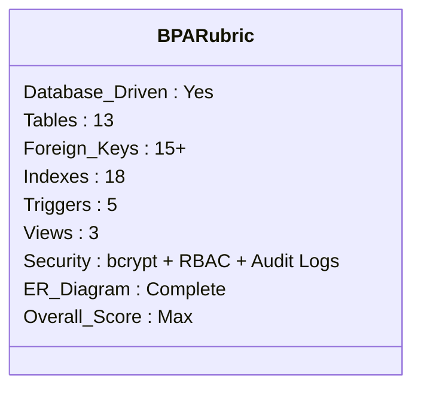

---

## 12. Technology Stack

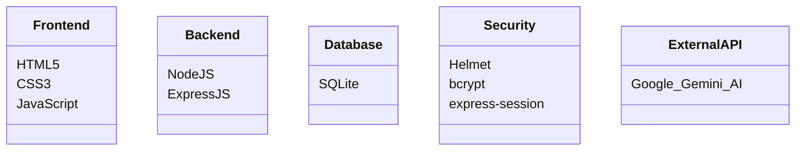

---

## 13. File Structure

```
BPA_Web/
├── server.js
├── config/
│   ├── database.js
│   └── schema.sql
├── middleware/
├── routes/
├── public/
└── docs/
```

---

## 14. External API Integration – Gemini AI

SkillSwap integrates Google Gemini AI via `/api/ai/chat` to provide AI-powered tutoring assistance. API keys are stored in environment variables and protected by rate limiting and audit logging.

---

```

---

If you want this **compressed**, **split by BPA rubric sections**, or **converted into multiple GitHub Wiki pages**, I can do that immediately.
```
