# SkillSwap
## Project Submission
---

## BPA Team Information
Chapter: Reedy High School BPA Chapter
School: Reedy High School
Team Members: Jyothir Manchu, Aaryan Porwal, Rishik Pamuru
TeamID: V04-WAT-S~02-1309-1
Location: Frisco, Texas
Date: January 15th, 2026


---
## Nessecary Info

Project Files: [https://drive.google.com/drive/folders/1x3xbBp9qk3woFguSVp85BaHjaNe52N67?usp=sharing](https://drive.google.com/drive/folders/1x3xbBp9qk3woFguSVp85BaHjaNe52N67?usp=sharing)

Github (Optional): [https://github.com/Rishikpamuru/Swap
](https://github.com/Rishikpamuru/SkillSwap_Website)

Live Website: [https://SkillSwapBPA.com](https://swap-production-bb01.up.railway.app/)

Logins:

### Admin:
User: admin
Password: Admin123!

### Test User:
User: alexm_dev01
Password: SecureA9!x

---

## Quick Overview
SkillSwap is a web application that aims to provide students with a community where they can exchange skills by connecting with tutors/learners in a secure, structured way. Users are able to register, log in, manage their profile, list skills they can either teach or want to learn, as well as communicate through built-in messaging. SkillSwap's system supports scheduling tutoring sessions through the use of offers and requests, which include details such as time, duration, location/meeting link, as well as session status tracking from creation to completion. After a session, students can leave their ratings and feedback to promote accountability and quality. Administrators specifically have elevated access for moderation and reporting, with their actions recorded for the sake of transparency.

SkillSwap runs on a Node.js + Express backend along with an SQLite database designed in normalized (3NF) form, using foreign keys, indexes, and supporting triggers/views for both performance and consistency. Security is a pivotal focus: passwords are stored as bcrypt hashes, sessions use secure cookie-based handling, requests are validated and parameterized to avoid injection, and security headers/rate limiting reduce common web risks. The platform additionally includes an optional AI tutoring assistant endpoint that can answer questions and provide learning help whilst keeping API keys protected via environment variables. In all, SkillSwap is built for the purpose of being an audit-friendly, privacy-aware, and reliable space for a school setting where safe collaboration and clear data integrity matter.

---


# Database Overview

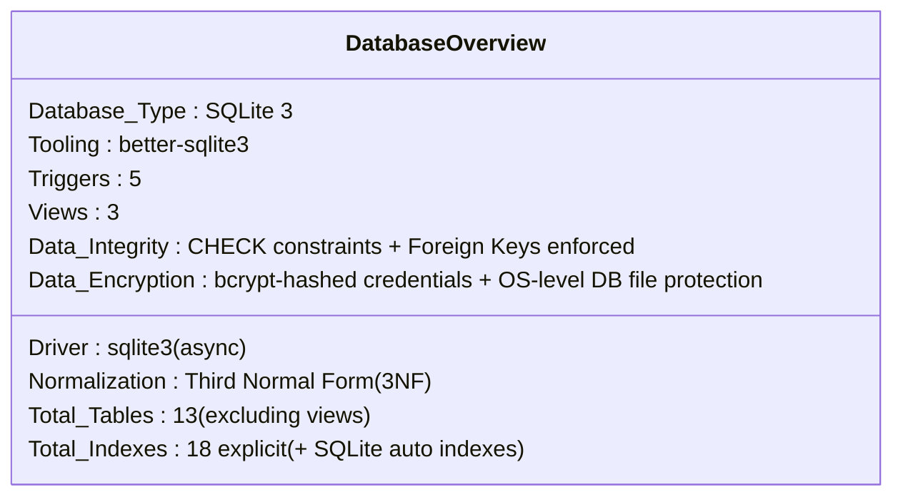

---

## A. Initialization & Runtime Migrations

SkillSwap uses a self-healing SQLite architecture.

* Canonical schema defined in `config/schema.sql`
* Database file (`skillswap.db`) is created automatically on first run
* Startup migrations in `config/database.js` perform PRAGMA checks and safe ALTER TABLE operations to maintain backward compatibility

Note on Query Logic:
SQLite does not support stored procedures. All complex business logic is implemented using secure, 
parameterized SQL queries and transactional operations within the Node.js server layer.

---

## B. Database Entity Relationship Diagram

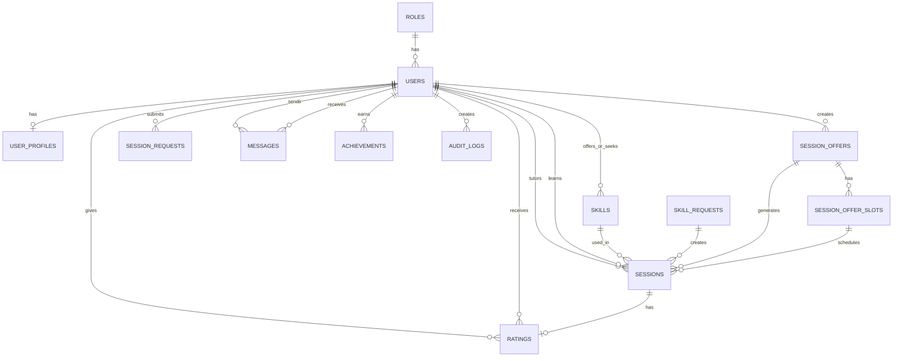

---

## C. Core Database Tables

### Roles

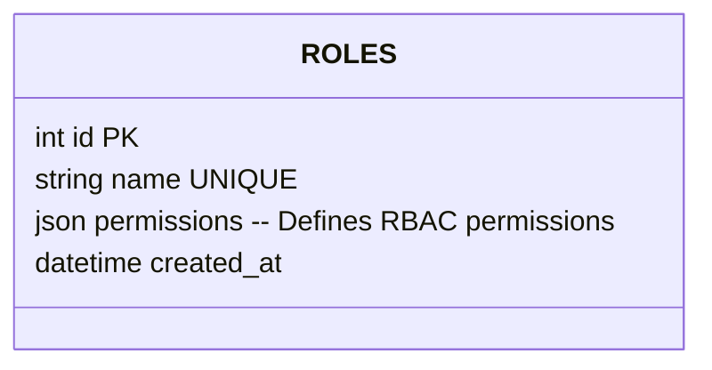

### Users

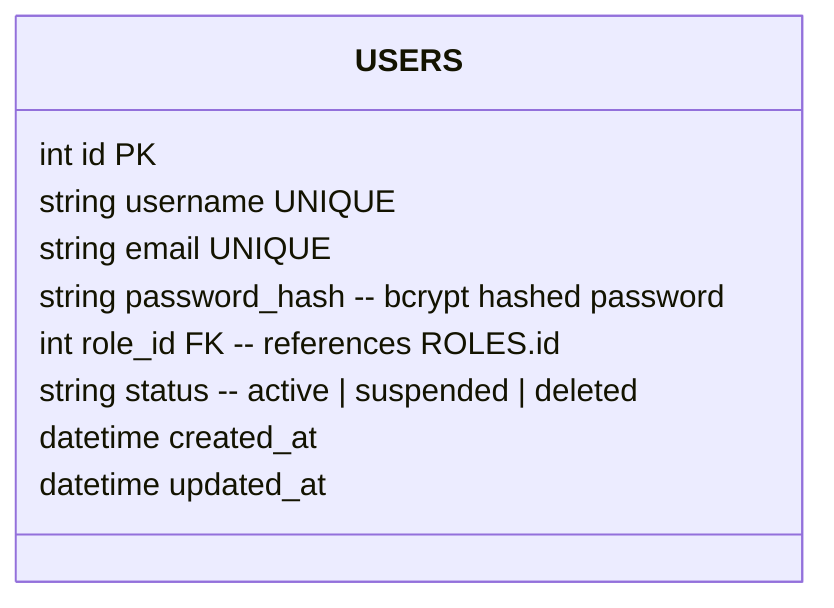

### User Profiles

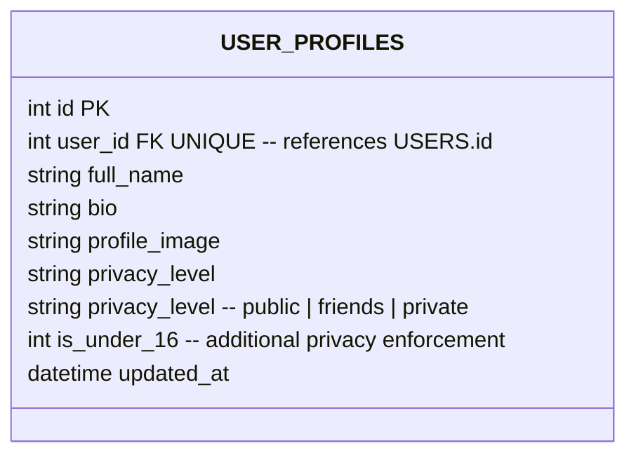

### Skills

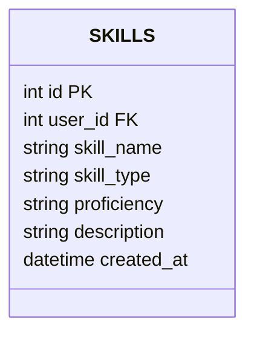

### Sessions

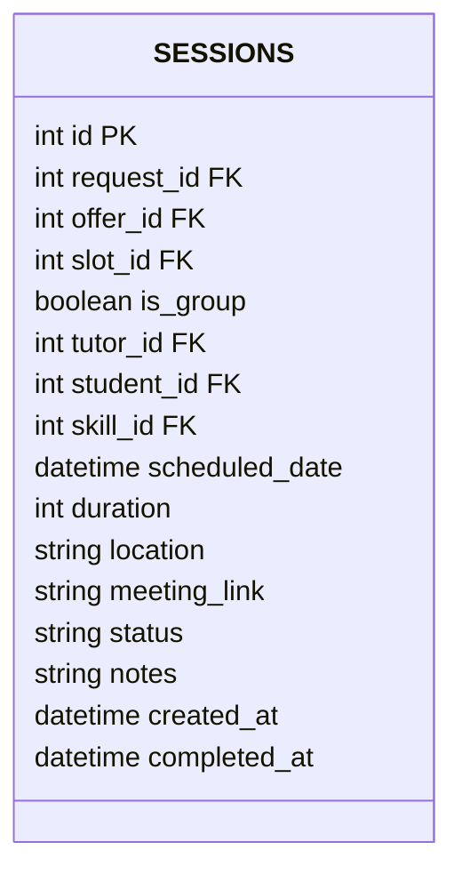

---

## D. Request Lifecycle

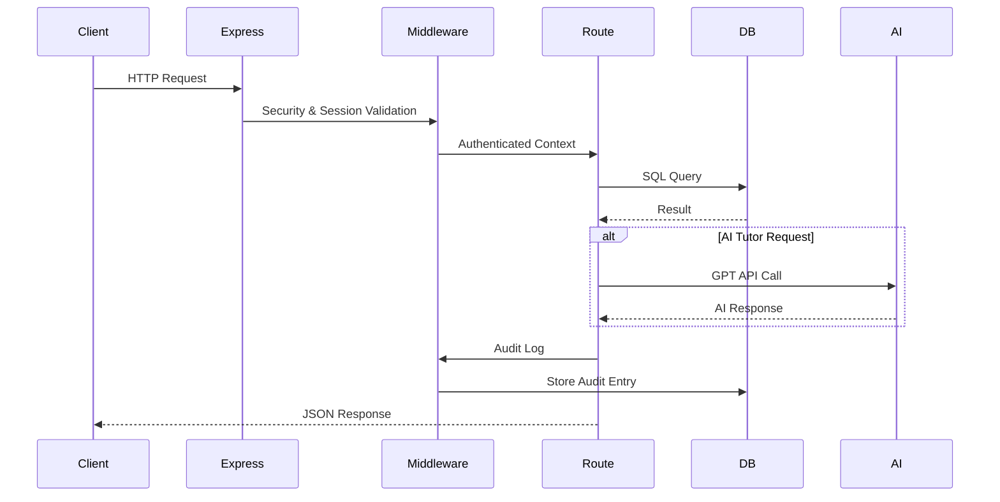

---

## E. Security Architecture

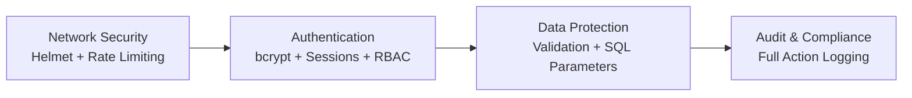

---

## F. Security Controls

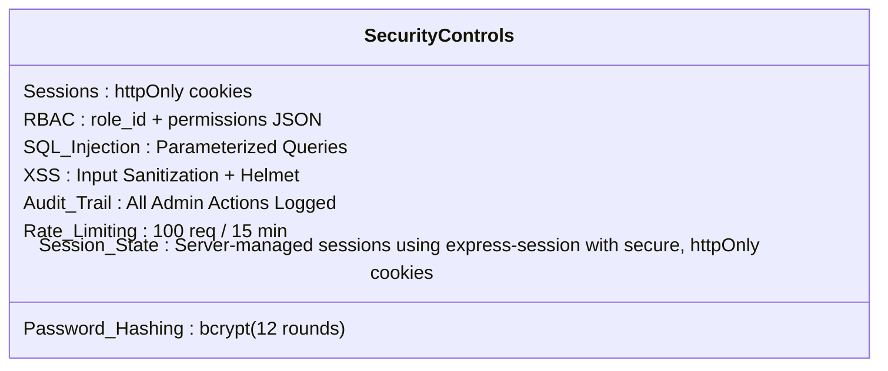
## G. Admin Functions

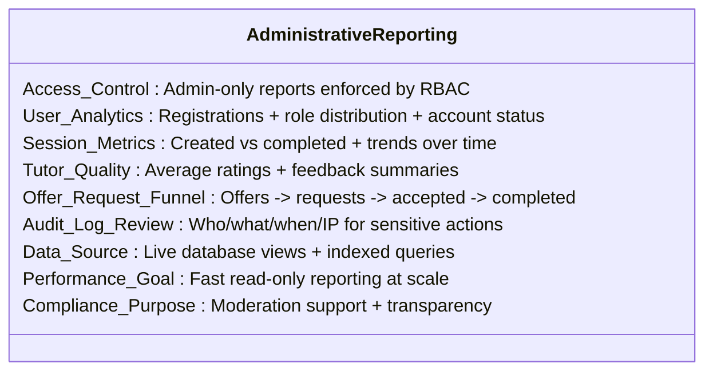

## H. Core Application Functions

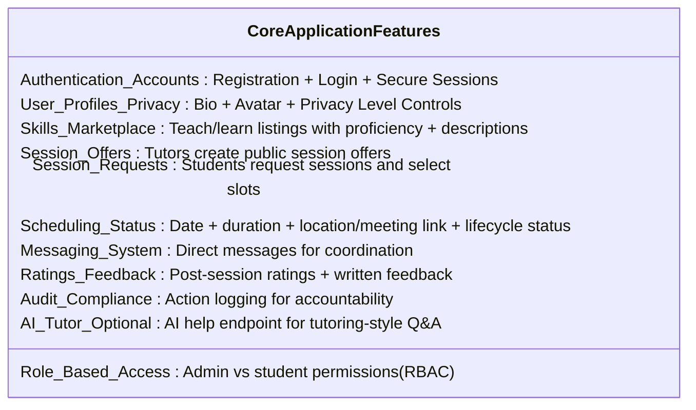

---

## I. Normalization Compliance

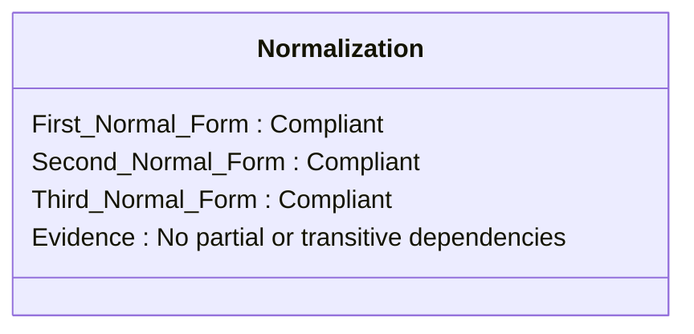
Unique Key Enforcement:
Primary and unique key constraints are used to prevent duplicate identities and ensure entity integrity. 
Examples include unique usernames and emails in USERS, a one-to-one relationship between USERS and USER_PROFILES, 
and a single rating per session enforced through a unique session_id constraint.

---

## J. BPA Rubric Alignment

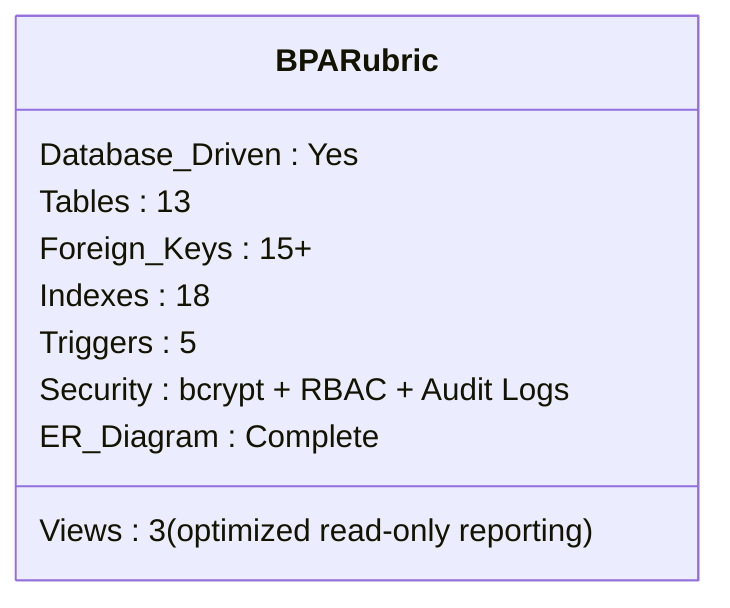

---

## K. Technology Stack

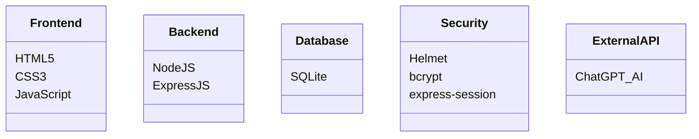

---

## L. File Structure

```
BPA_Web/
├── server.js
├── config/
│   ├── database.js
│   └── schema.sql
├── middleware/
├── routes/
├── public/
└── docs/
```

## Raw Schema is uploaded 

---

## M. External API Integration 

SkillSwap integrates ChatGPT AI via `/api/ai/chat` to provide AI-powered tutoring assistance. API keys are stored in environment variables and protected by rate limiting and audit logging.

---

# SkillSwap System Architecture


## A. High-Level System Architecture

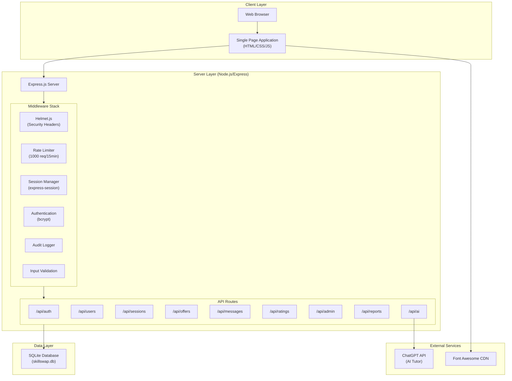

---

## B. Database Entity Relationship Diagram

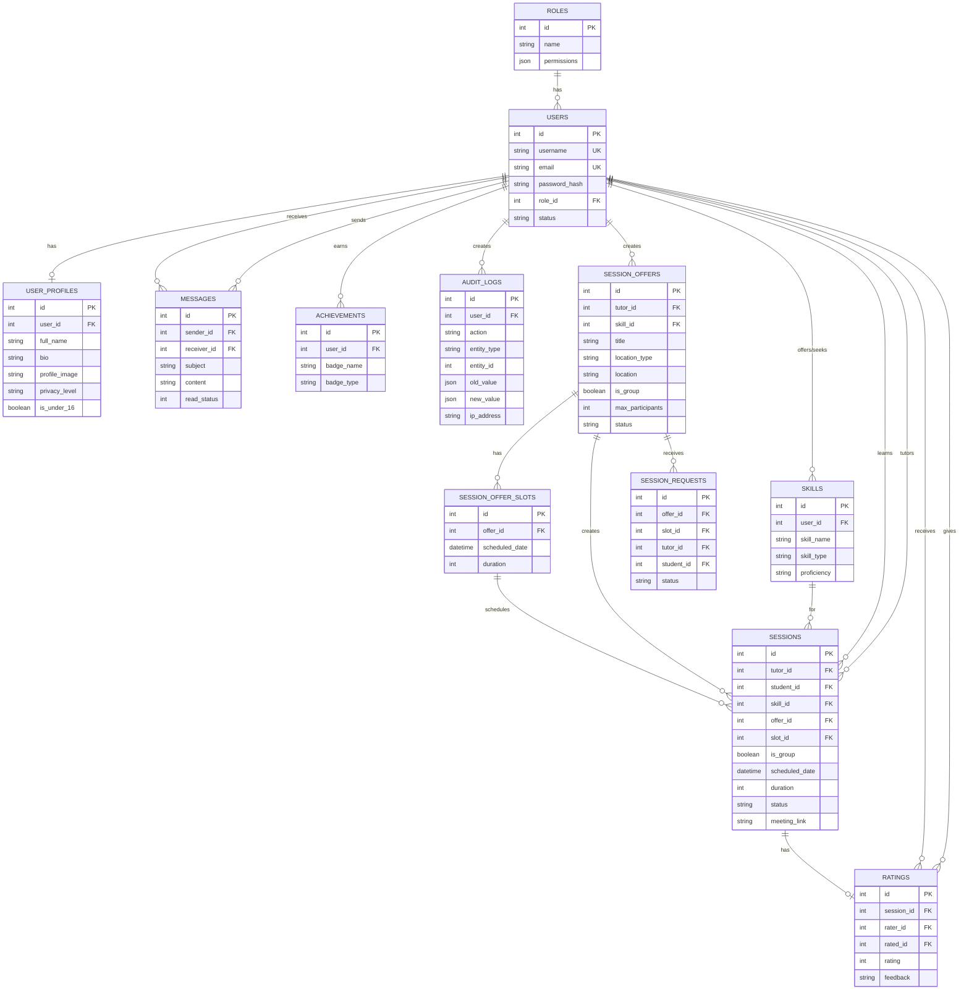

---

## C. Request Flow Diagram

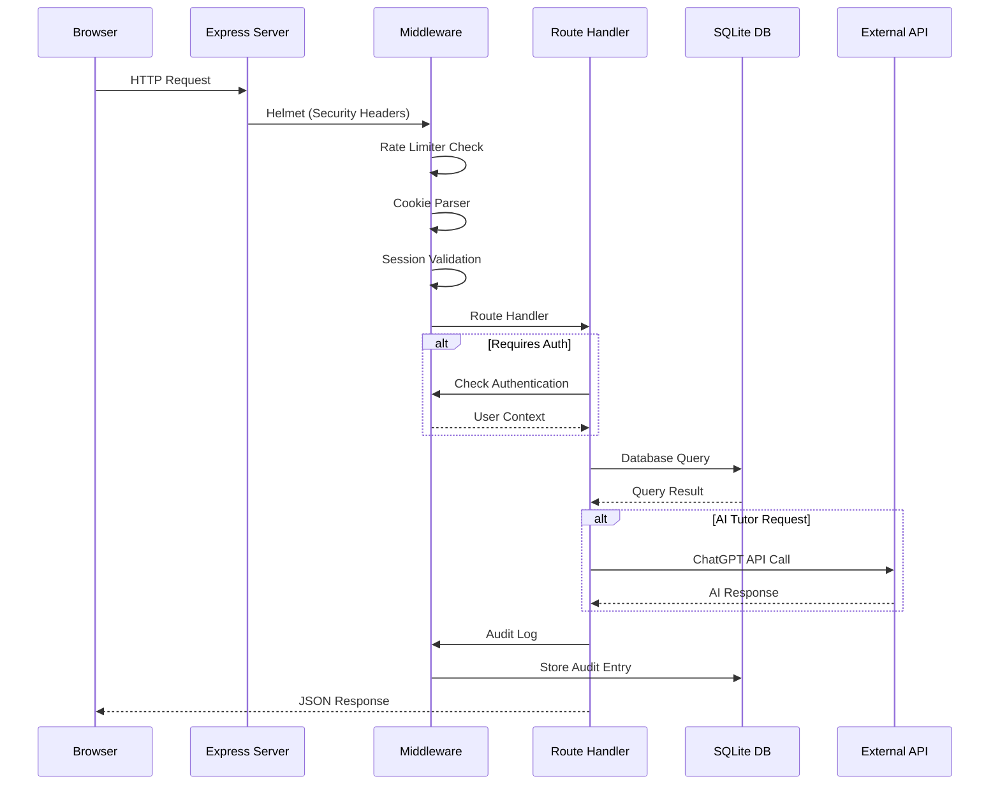

---

## D. Security Architecture

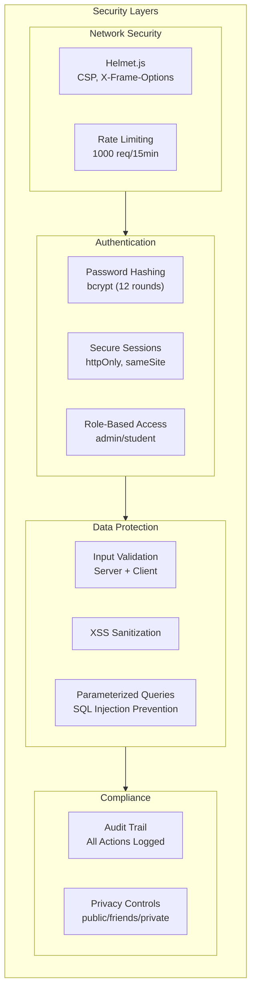

---

## E. Component Architecture

| Layer | Technology | Purpose |
|-------|------------|---------|
| **Frontend** | HTML5, CSS3, JavaScript | Single Page Application |
| **Styling** | Vanilla CSS with CSS Variables | Design system, responsive layout |
| **Icons** | Font Awesome 6.4 | UI iconography |
| **Backend** | Node.js + Express.js | REST API server |
| **Database** | SQLite (better-sqlite3/sqlite3) | Persistent data storage |
| **Authentication** | bcryptjs + express-session | Password hashing, session management |
| **Security** | Helmet.js + express-rate-limit | HTTP security headers, DDoS protection |
| **External API** | ChatGPT | AI-powered tutoring assistant |

---

## F. External API Integration

### ChatGPT (AI Tutor Feature)

The application integrates with **ChatGPT API** to provide an AI-powered tutoring assistant:

- **Endpoint:** `/api/ai/chat`
- **Purpose:** Answer student questions, explain concepts, provide tutoring support
- **Security:** API key stored in environment variables (`.env`)
- **Rate Limiting:** Subject to global rate limits + API quota

```javascript
// Example API call (routes/ai.js)
const response = await fetch('https://generativelanguage.googleapis.com/...', {
  method: 'POST',
  headers: { 'Content-Type': 'application/json' },
  body: JSON.stringify({ contents: [...] })
});
```

---

## G. File Structure

```
BPA_Web/
├── server.js              # Main entry point
├── config/
│   ├── database.js        # Database connection
│   └── schema.sql         # Database schema
├── middleware/
│   ├── auth.js            # Authentication functions
│   ├── audit.js           # Audit logging
│   └── validation.js      # Input validation
├── routes/
│   ├── auth.js            # Authentication routes
│   ├── users.js           # User management
│   ├── sessions.js        # Session scheduling
│   ├── offers.js          # Session offers
│   ├── messages.js        # Messaging system
│   ├── ratings.js         # Rating system
│   ├── admin.js           # Admin panel
│   ├── reports.js         # Analytics reports
│   └── ai.js              # AI tutor integration
├── public/
│   ├── index.html         # SPA entry point
│   ├── css/modern-ui.css  # Stylesheet
│   └── js/app-modern.js   # Frontend logic
└── docs/                  # Documentation
```

---

# Works Cited

---

## Technologies & Frameworks

### Backend Technologies

**Node.js**  
OpenJS Foundation. "Node.js." *Node.js*, 2024, https://nodejs.org/. Accessed 14 Jan. 2026.

**Express.js**  
OpenJS Foundation. "Express - Node.js Web Application Framework." *Express.js*, 2024, https://expressjs.com/. Accessed 14 Jan. 2026.

**SQLite**  
Hipp, D. Richard. "SQLite." *SQLite*, 2024, https://www.sqlite.org/. Accessed 14 Jan. 2026.

### Security Libraries

**bcryptjs**  
"bcryptjs - npm." *npm*, 2024, https://www.npmjs.com/package/bcryptjs. Accessed 14 Jan. 2026.

**Helmet.js**  
"Helmet.js - Help secure Express apps with various HTTP headers." *Helmet.js*, 2024, https://helmetjs.github.io/. Accessed 14 Jan. 2026.

**express-rate-limit**  
"express-rate-limit - npm." *npm*, 2024, https://www.npmjs.com/package/express-rate-limit. Accessed 14 Jan. 2026.

**express-session**  
"express-session - npm." *npm*, 2024, https://www.npmjs.com/package/express-session. Accessed 14 Jan. 2026.

**express-validator**  
"express-validator - npm." *npm*, 2024, https://www.npmjs.com/package/express-validator. Accessed 14 Jan. 2026.

### Frontend Libraries

**Font Awesome**  
Fonticons, Inc. "Font Awesome." *Font Awesome*, 2024, https://fontawesome.com/. Accessed 14 Jan. 2026.

**Google Fonts (Inter)**  
Google. "Google Fonts." *Google Fonts*, 2026, https://fonts.google.com/. Accessed 15 Jan. 2026.  
Rasmus Andersson. "Inter." *Google Fonts*, 2026, https://fonts.google.com/specimen/Inter. Accessed 15 Jan. 2026.

**cdnjs (CDN Hosting)**  
cdnjs. "cdnjs - The #1 free and open source CDN." *cdnjs*, 2026, https://cdnjs.com/. Accessed 15 Jan. 2026.

### External APIs

**OpenAI API**  
OpenAI. "OpenAI API." *OpenAI*, 2024, https://platform.openai.com/. Accessed 14 Jan. 2026.  
*Used for: AI Tutor (SkillBot) feature - Optional integration for educational assistance.*

---

## Development Tools

**Visual Studio Code**  
Microsoft. "Visual Studio Code." *Visual Studio Code*, 2024, https://code.visualstudio.com/. Accessed 14 Jan. 2026.

**npm (Node Package Manager)**  
npm, Inc. "npm." *npm*, 2024, https://www.npmjs.com/. Accessed 14 Jan. 2026.

**Git**  
Software Freedom Conservancy. "Git." *Git*, 2024, https://git-scm.com/. Accessed 14 Jan. 2026.

**Claude Opus**
Anthropic. "Claude." *Anthropic*, 2026, www.anthropic.com. Accessed 15 Jan. 2026.


---

## Design Resources

**CSS Color Variables**  
All color schemes and design tokens were created by the team based on modern UI/UX principles.

**Icons**  
All icons used are from Font Awesome Free (MIT License).  
Fonticons, Inc. "Font Awesome Free License." *Font Awesome*, 2024, https://fontawesome.com/license/free. Accessed 14 Jan. 2026.

---

## Educational References

**BPA Workplace Skills Assessment Program**  
Business Professionals of America. "Workplace Skills Assessment Program." *Business Professionals of America*, 2025, https://bpa.org/. Accessed 14 Jan. 2026.

**BPA Web Application Team Competition Resources**  
Business Professionals of America. "Competitive Events." *Business Professionals of America*, 2026, https://bpa.org/competitive-events/. Accessed 15 Jan. 2026.  
Business Professionals of America. "Web Application Team." *Business Professionals of America*, 2026, https://bpa.org/competitive-events/web-application-team/. Accessed 15 Jan. 2026.  
Business Professionals of America. "BPA Release Forms." *Business Professionals of America*, 2026, https://bpa.org/competitive-events/competitive-event-submission-process/. Accessed 15 Jan. 2026.

**Web Security Best Practices**  
OWASP Foundation. "OWASP Top Ten." *OWASP*, 2024, https://owasp.org/www-project-top-ten/. Accessed 14 Jan. 2026.  
*Referenced for: SQL injection prevention, XSS mitigation, secure session management.*

**Database Normalization**  
Codd, E.F. "A Relational Model of Data for Large Shared Data Banks." *Communications of the ACM*, vol. 13, no. 6, 1970, pp. 377-387.  
*Referenced for: Database schema design principles.*

---

## Image Assets

**SkillSwap Logo**  
Original artwork created by team members.  
© 2026 Reedy HS BPA Chapter

**Authentication Background Image (RedAndBlueBack.png)**  
Background image used on authentication pages (public/RedAndBlueBack.png). Original artwork created by team members.  
© 2026 Reedy HS BPA Chapter

**Profile Avatars**  
Default avatars are generated using user initials (no external images required).

---

## Code Attribution

**All source code in this project is original work by:**
- Jyothir Manchu
- Aaryan Porwal
- Rishik Pamuru

No code was copied from external sources, tutorials, or third-party repositories. All functionality was developed from scratch following BPA competition guidelines prohibiting the use of application generators, pre-built templates, or auto-generated site builders.

---

## Third-Party npm Packages Used

| Package | Version | License | Purpose |
|---------|---------|---------|---------|
| express | ^4.18.2 | MIT | Web server framework |
| sqlite3 | ^5.1.7 | BSD-3-Clause | Database driver |
| better-sqlite3 | ^9.6.0 | MIT | Sync SQLite driver |
| bcryptjs | ^2.4.3 | MIT | Password hashing |
| express-session | ^1.17.3 | MIT | Session management |
| express-rate-limit | ^7.1.5 | MIT | Rate limiting |
| express-validator | ^7.0.1 | MIT | Input validation |
| helmet | ^7.1.0 | MIT | Security headers |
| multer | ^1.4.5-lts.1 | MIT | File uploads |
| cookie-parser | ^1.4.6 | MIT | Cookie parsing |
| dotenv | ^16.3.1 | BSD-2-Clause | Environment config |

### npm Package Citations (Additional)

**sqlite3 (npm package)**  
"sqlite3 - npm." *npm*, 2024, https://www.npmjs.com/package/sqlite3. Accessed 14 Jan. 2026.

**better-sqlite3**  
"better-sqlite3 - npm." *npm*, 2024, https://www.npmjs.com/package/better-sqlite3. Accessed 14 Jan. 2026.

**multer**  
"multer - npm." *npm*, 2024, https://www.npmjs.com/package/multer. Accessed 14 Jan. 2026.

**cookie-parser**  
"cookie-parser - npm." *npm*, 2024, https://www.npmjs.com/package/cookie-parser. Accessed 14 Jan. 2026.

**dotenv**  
"dotenv - npm." *npm*, 2024, https://www.npmjs.com/package/dotenv. Accessed 14 Jan. 2026.

---
