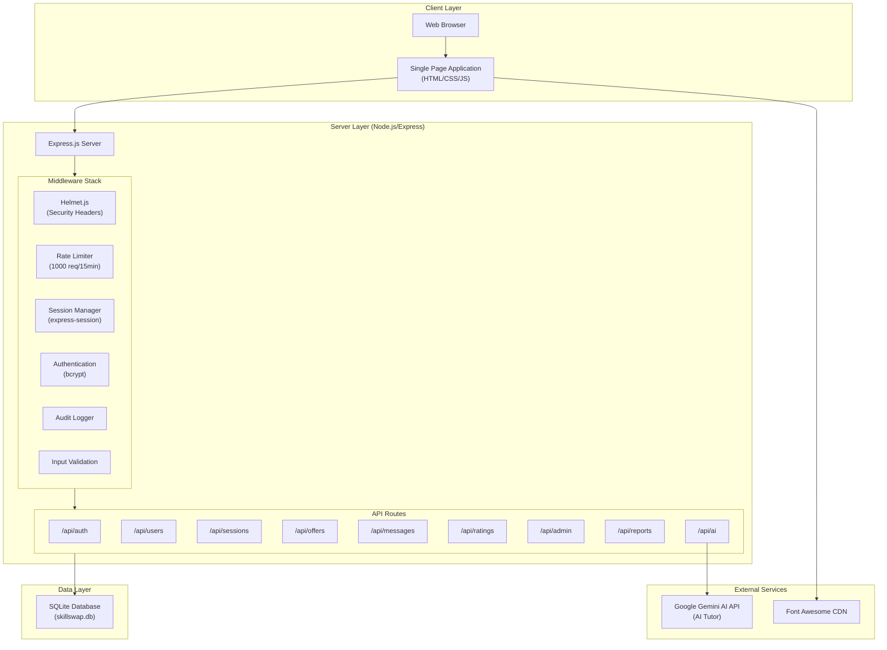
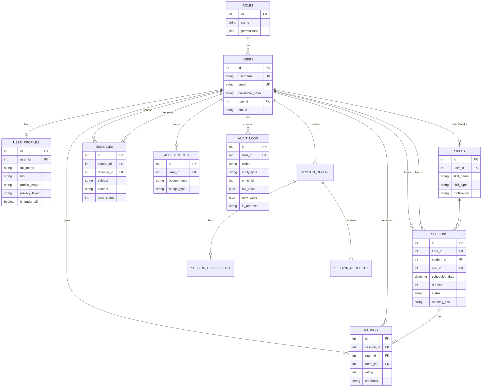
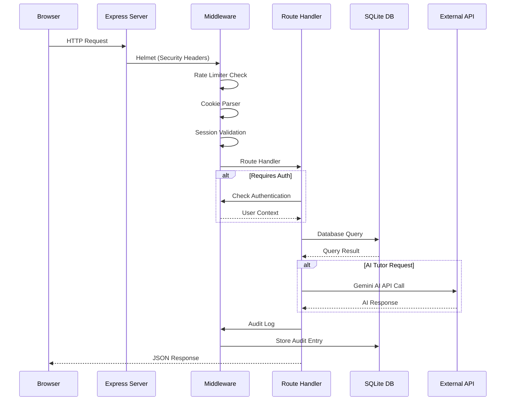
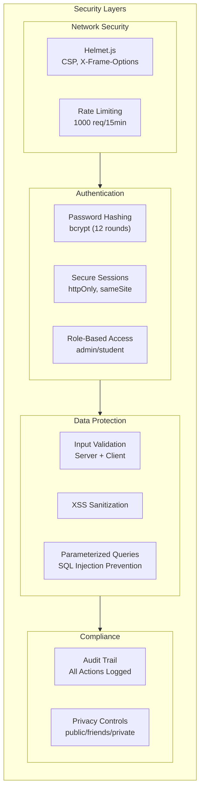

# SkillSwap System Architecture

## Overview

SkillSwap is a database-driven web application built on a Node.js/Express backend with SQLite database storage. This document provides a comprehensive view of the system architecture for the BPA Web Application Team Competition.

---

## High-Level System Architecture



---

## Database Entity Relationship Diagram



---

## Request Flow Diagram



---

## Security Architecture



---

## Component Architecture

| Layer | Technology | Purpose |
|-------|------------|---------|
| **Frontend** | HTML5, CSS3, JavaScript | Single Page Application |
| **Styling** | Vanilla CSS with CSS Variables | Design system, responsive layout |
| **Icons** | Font Awesome 6.4 | UI iconography |
| **Backend** | Node.js + Express.js | REST API server |
| **Database** | SQLite (better-sqlite3/sqlite3) | Persistent data storage |
| **Authentication** | bcryptjs + express-session | Password hashing, session management |
| **Security** | Helmet.js + express-rate-limit | HTTP security headers, DDoS protection |
| **External API** | Google Gemini AI | AI-powered tutoring assistant |

---

## External API Integration

### Google Gemini AI (AI Tutor Feature)

The application integrates with **Google's Gemini AI API** to provide an AI-powered tutoring assistant:

- **Endpoint:** `/api/ai/chat`
- **Purpose:** Answer student questions, explain concepts, provide tutoring support
- **Security:** API key stored in environment variables (`.env`)
- **Rate Limiting:** Subject to global rate limits + API quota

```javascript
// Example API call (routes/ai.js)
const response = await fetch('https://generativelanguage.googleapis.com/...', {
  method: 'POST',
  headers: { 'Content-Type': 'application/json' },
  body: JSON.stringify({ contents: [...] })
});
```

---

## File Structure

```
BPA_Web/
├── server.js              # Main entry point
├── config/
│   ├── database.js        # Database connection
│   └── schema.sql         # Database schema
├── middleware/
│   ├── auth.js            # Authentication functions
│   ├── audit.js           # Audit logging
│   └── validation.js      # Input validation
├── routes/
│   ├── auth.js            # Authentication routes
│   ├── users.js           # User management
│   ├── sessions.js        # Session scheduling
│   ├── offers.js          # Session offers
│   ├── messages.js        # Messaging system
│   ├── ratings.js         # Rating system
│   ├── admin.js           # Admin panel
│   ├── reports.js         # Analytics reports
│   └── ai.js              # AI tutor integration
├── public/
│   ├── index.html         # SPA entry point
│   ├── css/modern-ui.css  # Stylesheet
│   └── js/app-modern.js   # Frontend logic
└── docs/                  # Documentation
```

---

## BPA Team Information

**Chapter:** Reedy High School BPA Chapter  
**Team Members:** Jyothir Manchu, Aaryan Porwal, Rishik Pamuru  
**Location:** Frisco, Texas  
**Year:** 2026
